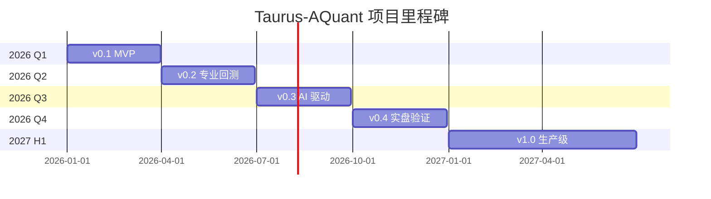

# 项目路线图

**Taurus-AQuant 发展方向与里程碑规划**

---

## 🎯 项目愿景

打造一个 **易用、专业、开放** 的个人算法交易平台，让每个人都能通过 AI 技术降低量化交易的技术门槛，实现智能化投资。

### 核心目标

1. **降低技术门槛**：零编程基础也能使用基础功能
2. **AI 赋能决策**：利用大语言模型辅助策略开发和风险管理
3. **安全可控**：完善的风控系统，确保资金安全
4. **开放协作**：开源社区驱动，持续迭代优化

---

## 📅 版本规划

### v0.1 - MVP（最小可用产品）【2026 Q1-Q2】

**目标**：验证核心功能 + LLM Agent，跑通基本流程

**⚠️ 评审调整**：基于可行性评审，MVP 包含 LLM Agent，预计开发时间 5-6 周

#### 核心功能
- [x] 基础架构搭建
  - [x] 项目结构设计
  - [x] Docker 容器化配置
  - [x] 文档体系建立
  - [x] Git 版本控制初始化
- [ ] 数据管理模块（1 周）
  - [ ] Tushare 数据源接入
  - [ ] PostgreSQL 数据存储
  - [ ] Redis 缓存层
  - [ ] 交易日历服务
- [ ] 回测引擎模块（1.5 周）
  - [ ] Backtrader 集成
  - [ ] 3-5 个内置策略
  - [ ] 基础绩效分析
  - [ ] 回测报告生成
- [ ] LLM Agent 模块（1.5 周）⭐ **核心特色**
  - [ ] OpenAI GPT-4 集成
  - [ ] 自然语言生成策略
  - [ ] 策略代码校验
  - [ ] Agent 对话界面
- [ ] Web UI（1 周）
  - [ ] Streamlit 基础界面
  - [ ] 策略管理页面
  - [ ] 回测配置页面
  - [ ] Agent 对话页面
  - [ ] 结果可视化
- [ ] API 服务（0.5 周）
  - [ ] FastAPI 基础框架
  - [ ] 数据接口
  - [ ] 回测接口
  - [ ] Agent 接口
- [ ] Docker 集成（0.5 周）
  - [ ] Dockerfile 编写
  - [ ] docker-compose.yml 配置
  - [ ] 一键启动脚本

**总计：6 周**（含缓冲）

#### 验收标准
- ✅ 用户能在 15 分钟内启动系统
- ✅ 能完成第一个回测示例
- ✅ 能通过自然语言生成简单策略
- ✅ 回测报告包含核心指标
- ✅ LLM Agent 能正确理解 80% 的用户意图

---

### v0.2 - 专业回测【2026 Q2】

**目标**：完善回测功能，支持专业研究

#### 核心功能
- [ ] 策略库扩展
  - [ ] 10+ 内置策略（趋势、均值回归、套利）
  - [ ] 因子库（动量、价值、质量、波动率）
  - [ ] 策略模板生成器
- [ ] 回测引擎增强
  - [ ] Rqalpha 集成（可选）
  - [ ] 多周期回测（日线、分钟线）
  - [ ] 多品种支持（股票、ETF）
  - [ ] 组合回测
- [ ] 绩效分析增强
  - [ ] 完整的绩效指标
  - [ ] Brison 归因分析
  - [ ] 风险分析（VaR、CVaR）
  - [ ] 基准对比
- [ ] 数据管理增强
  - [ ] Tushare Pro 数据源
  - [ ] 数据质量检查
  - [ ] 自动数据更新
  - [ ] 数据导出功能
- [ ] 参数优化
  - [ ] 网格搜索
  - [ ] 遗传算法优化
  - [ ] Walk-Forward 分析

#### 验收标准
- ✅ 支持 10+ 策略和 20+ 因子
- ✅ 回测速度提升 50%
- ✅ 绩效报告达到专业水准

---

### v0.3 - AI 驱动【2026 Q3】

**目标**：集成 LLM Agent，实现智能化交互

#### 核心功能
- [ ] LLM Agent 模块
  - [ ] OpenAI GPT-4 集成
  - [ ] Claude 集成（可选）
  - [ ] 本地 LLM 支持（Ollama）
  - [ ] Prompt 管理系统
- [ ] 自然语言交互
  - [ ] 自然语言生成策略
  - [ ] 策略优化建议
  - [ ] 风险点分析
  - [ ] 市场解读
- [ ] 智能辅助
  - [ ] 策略代码审查
  - [ ] 参数调优建议
  - [ ] 异常检测与告警
  - [ ] 交易计划生成
- [ ] 知识库
  - [ ] 金融知识库
  - [ ] 策略模式库
  - [ ] 常见问题库
  - [ ] 教程库

#### 验收标准
- ✅ LLM 生成的策略能通过语法检查
- ✅ 80% 的自然语言指令能被正确理解
- ✅ Agent 响应时间 < 5 秒

---

### v0.4 - 实盘验证【2026 Q4】

**目标**：支持仿真交易，验证实盘可行性

#### 核心功能
- [ ] 交易网关模块
  - [ ] vn.py 框架集成
  - [ ] XTP 券商接口（仿真）
  - [ ] 订单管理系统
  - [ ] 持仓管理
- [ ] 风控系统
  - [ ] 仓位控制
  - [ ] 频率限制
  - [ ] 黑名单/白名单
  - [ ] 止损/止盈
  - [ ] 回撤控制
- [ ] 执行器
  - [ ] 限价单执行
  - [ ] TWAP 算法
  - [ ] VWAP 算法
  - [ ] 冰山订单
- [ ] 监控面板
  - [ ] 实时持仓监控
  - [ ] 盈亏实时计算
  - [ ] 风控指标监控
  - [ ] 异常告警
- [ ] 合规支持
  - [ ] 申报频率统计
  - [ ] 交易日志记录
  - [ ] 合规报告生成

#### 验收标准
- ✅ 仿真交易稳定运行 3 个月
- ✅ 无重大技术故障
- ✅ 风控系统有效触发

---

### v1.0 - 生产级【2027 H1】

**目标**：高可用、高性能、可扩展的生产级系统

#### 核心功能
- [ ] 高可用架构
  - [ ] 服务高可用（多实例、负载均衡）
  - [ ] 数据库高可用（主从复制、自动故障转移）
  - [ ] 缓存集群
  - [ ] 消息队列（异步任务）
- [ ] 性能优化
  - [ ] 回测性能优化（并行化、增量计算）
  - [ ] API 性能优化（缓存、异步）
  - [ ] 数据库优化（索引、分区）
  - [ ] 前端性能优化
- [ ] 安全加固
  - [ ] API 鉴权（JWT）
  - [ ] 敏感信息加密
  - [ ] SQL 注入防护
  - [ ] XSS 防护
  - [ ] CSRF 防护
- [ ] 监控与运维
  - [ ] 日志聚合（ELK）
  - [ ] 性能监控（Prometheus + Grafana）
  - [ ] 告警系统
  - [ ] 自动化运维脚本
- [ ] 多用户支持
  - [ ] 用户管理系统
  - [ ] 权限管理
  - [ ] 多账户管理
  - [ ] 配额管理
- [ ] 插件系统
  - [ ] 插件框架
  - [ ] 第三方数据源插件
  - [ ] 第三方策略插件
  - [ ] 第三方执行器插件

#### 验收标准
- ✅ 系统可用性 > 99.9%
- ✅ API 响应时间 < 200ms（P95）
- ✅ 支持并发用户数 > 100

---

## 📊 关键里程碑



### 里程碑详情

| 里程碑 | 预计完成时间 | 关键交付物 | 状态 |
|--------|--------------|------------|------|
| **M1: 架构设计完成** | 2026-01-31 | 架构设计文档、技术选型报告 | ✅ 已完成 |
| **M2: MVP 发布** | 2026-03-31 | v0.1 版本、快速入门文档 | 🔄 进行中 |
| **M3: 专业回测发布** | 2026-06-30 | v0.2 版本、策略库、因子库 | 📋 计划中 |
| **M4: LLM Agent 发布** | 2026-09-30 | v0.3 版本、智能助手 | 📋 计划中 |
| **M5: 仿真交易发布** | 2026-12-31 | v0.4 版本、风控系统 | 📋 计划中 |
| **M6: 生产级发布** | 2027-06-30 | v1.0 版本、高可用架构 | 📋 计划中 |

---

## 🔄 功能演进路径

### 1. 数据管理演进

```
v0.1: AkShare 基础数据
  ↓
v0.2: Tushare Pro + 数据质量检查
  ↓
v0.3: 多数据源 + 自动更新
  ↓
v0.4: 实时数据流
  ↓
v1.0: 分布式数据服务 + 数据湖
```

### 2. 回测引擎演进

```
v0.1: Backtrader 单品种日线
  ↓
v0.2: 多品种 + 多周期 + 组合回测
  ↓
v0.3: 参数优化 + Walk-Forward
  ↓
v0.4: 实时回测（仿真）
  ↓
v1.0: 分布式回测 + 增量计算
```

### 3. LLM Agent 演进

```
v0.3: 基础对话 + 策略生成
  ↓
v0.4: 策略优化 + 风险分析
  ↓
v1.0: 自主决策 + 多 Agent 协作
```

### 4. 交易系统演进

```
v0.4: 仿真交易 + 基础风控
  ↓
v1.0: 实盘交易 + 高级风控 + 算法交易
  ↓
Future: 多市场 + 多策略 + 自适应
```

---

## 🏗️ 技术债务计划

### 当前技术债务

| 债务项 | 影响 | 优先级 | 计划解决版本 |
|--------|------|--------|--------------|
| 缺少单元测试 | 代码质量 | 高 | v0.2 |
| 缺少 API 文档 | 协作效率 | 中 | v0.2 |
| 性能监控缺失 | 运维困难 | 中 | v0.3 |
| 日志系统不完善 | 故障排查困难 | 中 | v0.3 |
| 数据库索引缺失 | 性能问题 | 低 | v0.4 |

### 技术债务治理策略

1. **持续重构**：每个版本预留 20% 时间处理技术债务
2. **代码审查**：强制 Code Review，防止引入新技术债务
3. **自动化测试**：逐步提升测试覆盖率（目标 > 80%）
4. **文档同步**：功能开发与文档更新同步进行

---

## 📝 更新日志

详见 [CHANGELOG.md](../CHANGELOG.md)（TODO）

---

## 🤝 贡献者招募方向

我们需要以下方面的贡献者：

### 1. 策略开发者

**需求**：有量化策略开发经验，熟悉技术指标和因子

**贡献方向**：
- 分享有效的交易策略
- 完善因子库
- 优化策略参数
- 编写策略教程

### 2. 数据工程师

**需求**：熟悉数据采集、清洗、存储

**贡献方向**：
- 优化数据获取性能
- 提升数据质量
- 添加新数据源
- 数据 pipeline 优化

### 3. 前端开发者

**需求**：熟悉 Streamlit / React / Vue

**贡献方向**：
- 改进 Web UI 体验
- 添加可视化图表
- 优化前端性能
- 响应式设计

### 4. 测试工程师

**需求**：熟悉 Python 测试框架（pytest）

**贡献方向**：
- 编写单元测试
- 编写集成测试
- 提升测试覆盖率
- 自动化测试流程

### 5. AI/LLM 研究者

**需求**：熟悉大语言模型、Prompt Engineering

**贡献方向**：
- 优化 LLM Prompt
- 改进 Agent 逻辑
- 探索多 Agent 协作
- 知识库建设

### 6. 量化研究员

**需求**：有量化研究背景，熟悉统计学、机器学习

**贡献方向**：
- 策略研究
- 风险模型
- 绩效归因
- 市场微观结构研究

---

## 💡 功能建议

欢迎通过以下方式提出功能建议：

1. **GitHub Issues**：[提交功能建议](https://github.com/yourusername/taurus-Aquant/issues/new?template=feature_request.md)
2. **GitHub Discussions**：[参与讨论](https://github.com/yourusername/taurus-Aquant/discussions)
3. **邮件**：your.email@example.com

我们会定期评估建议的可行性和优先级。

---

## 🎯 成功指标

### v0.1 - MVP
- GitHub Stars > 100
- 有效用户反馈 > 20 条
- 文档完整度 > 80%

### v0.2 - 专业回测
- GitHub Stars > 500
- 策略库数量 > 10
- 周活跃用户 > 50

### v0.3 - AI 驱动
- GitHub Stars > 1000
- LLM 调用次数 > 10000
- 用户满意度 > 4.0/5.0

### v0.4 - 实盘验证
- 仿真交易用户 > 20
- 仿真交易运行时长 > 3 个月
- 无重大安全事故

### v1.0 - 生产级
- GitHub Stars > 3000
- 实盘交易用户 > 10
- 系统可用性 > 99.9%
- 社区贡献者 > 20

---

## 📞 联系方式

- **项目负责人**：your.email@example.com
- **GitHub**：https://github.com/yourusername/taurus-Aquant

---

**最后更新时间**：2026-03-02
